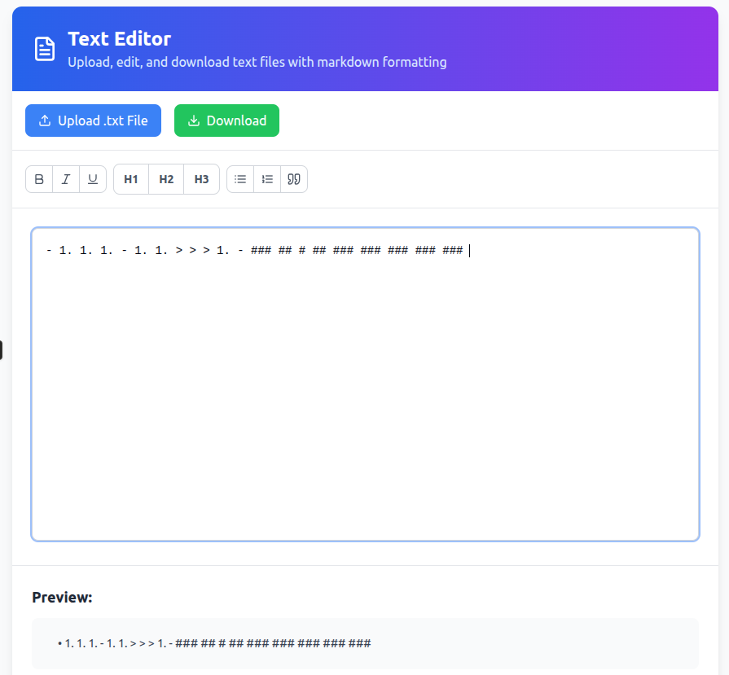

# 📝 Text Editor App

A simple web-based text editor where users can upload `.txt` files, edit their content in a rich text interface (using Tiptap or Draft.js), and save the edited file back. Built with **React** frontend and **Flask** backend.

---

## 📸 Preview



---

## Features

- Upload `.txt` files
- Edit file content in a rich text editor (Tiptap)
- Save edited content
- Flask backend for file handling
- React frontend with modern UI

---

## Project Structure

text-editor-app/
├── backend/
│ └── app.py
│ └── uploads/
├── frontend/ # React app (with Draft.js or Tiptap)
├── screenshots/
│ └── text-editor-app.png
├── README.md


---

## 🧪 Installation & Run

### 🔧 Backend (Flask)

```bash
cd backend
python3 -m venv venv
source venv/bin/activate  # On Windows use: venv\Scripts\activate
pip install Flask
python app.py


### Frontend (React)

bash
Copy
Edit
cd frontend
npm install
npm run dev

| Method | Endpoint               | Description              |
| ------ | ---------------------- | ------------------------ |
| POST   | `/upload`              | Upload a `.txt` file     |
| GET    | `/download/<filename>` | Download the edited file |


Tech Stack
Frontend: React + Vite + Tiptap (or Draft.js)

Backend: Flask (Python)

Styling: Tailwind CSS (optional)

Hosting: Localhost for development

📦 Requirements
Node.js and npm

Python 3.x

Flask

🤝 Contributing
Pull requests are welcome. For major changes, please open an issue first.

### License
This project is licensed under the MIT License.


